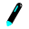

<div align="center">
  <h1>lcd-board</h1>
  
  <p>
    A <strong>Collaborative Whiteboarding</strong> Web App
  </p>
</div>

<hr>

This web app operates on the idea of rooms, where each room has a unique whiteboard. It allows multiple users to concurrently connect and draw in a room at any given point in time.

As of now, room whiteboards are only persistent for as long as at least one user is connected to the room. If no one's connected to a room with a non-empty whiteboard, it'll be automatically discarded after 60 seconds.

The web app has quite a bit of drawing tools to choose from, and you can pick the color and size on supported tools. Following is a list of them:
- Pen
    - Basic pen.
    - Auto-smoothes strokes.
    - Optimised for memory efficiency.
        - Best for usage on large drawings.
- Dynamic Pen
    - Standard pen for all your needs.
    - Supports pressure sensitivity, e.g. via
        - Wacom tablet and stylus (requires Firefox, Chrome)
        - Apple Pencil (requires Safari on iPadOS 13+)
        - 3D Touch (requires Safari on iOS 13+)
        - Apple Force Touch trackpad (requires Safari)
        - ... and anything else that supports [PointerEvent.pressure](https://developer.mozilla.org/en-US/docs/Web/API/PointerEvent/pressure)
- Fountain Pen
    - Expressive pen style.
    - Dynamic stroke size which changes with speed.
        - Allows for natural-looking ink.
- Eraser
    - Mistakes can be corrected easily.
    - Note: Performs vector erasing, not pixel erasing.
- Laser Pointer
    - Just like using a real life laser pointer.
    - Especially useful for collabration.
- Selector
    - Select strokes and delete them using the delete or backspace key.
- Weighted Pen [WIP]
    - Temporarily removed as it isn't working.

Have fun!

## Quickstart

- Make sure you already have `nodejs` and `npm` installed.
- Install `yarn`
```
npm install -g yarn
```
- Install dependencies
```
yarn install
```
- Build project
```
yarn run gulp build
```
- Start the server
```
yarn start
```
- Go to [http://localhost:8080](http://localhost:8080)
- Login to a room and draw stuff
- ???
- Profit

## Full installation and usage details
### Requirements
Just make sure you have nodejs and npm and you're good to go!

### Installing
Install yarn if necessary
```
npm install -g yarn
```

Next, install all dependencies required.
```
yarn install
```

### Building
Build the entire project

```
yarn run gulp build
```

...or you can build parts of the project

```
yarn run gulp styles
yarn run gulp scripts
yarn run gulp main
yarn run gulp libs # copies lib after installing
yarn run gulp assets
yarn run gulp views
```

Watch the entire project for changes and rebuild if needed
```
yarn run gulp watch
```

... or watch only some parts
```
yarn run gulp 'watch styles'
yarn run gulp 'watch scripts'
yarn run gulp 'watch views'
yarn run gulp 'watch main'
```

### Debugging
Debugging is made easy with the following:
```
yarn debug
```
Server automatically restarts on project rebuild when using this.

### Running
Ready to start the server and use the webapp?
```
yarn start
```
Done!

The page will thus be hosted on `localhost:8080` by default.

### Drawing

Click and drag a mouse, drag your finger across a touchscreen, or write using a digital stylus. You can draw anywhere on the entire window, except the top bar.

Click or tap the current drawing tool or connection status indicator to view more options.

## Implementation details

### DrawingTool
A `DrawingTool` is simply a dummy implementation of a fixed-width pen. Its size is configurable but color is determined based on the canvas active color by default.

New tools are created by subclassing `DrawingTool`.

When creating a subclass of `DrawingTool`, you **must** override the `clone()` method and implement it correctly so as the tool can be cloned for drawing by each separate user.

You should only need to override the following methods to configure your tool's handling from system events all the way to drawing a stroke:

- `handleMouseEventAsDrawPreviewEvent(_:)`
    - handles conversion from a paper.js MouseEvent to a `DrawPreviewEvent`.
- `handleKeyEventAsDrawEvent(_:)`
    - handles conversion from a paper.js KeyEvent to a `DrawEvent`.
- `processDrawPreviewEvent(_:)`
    - handles previewing and recording a `DrawPreviewEvent` to graphics or actions on the canvas.
- `createDrawEventFromPreviewActivity()`
    - handles the processing of historical events to a `DrawEvent`.
    - you should provide data in the form of `DrawData` objects, which should contain the paper.js path data as an exported JSON string.
- `processDrawEvent(_:)`
    - handles translating a `DrawEvent` to graphics or actions on the canvas.

Add them to the list of exported tools in `DrawingTool.ts`, and remember to import them and add to the list of tools in `index.ts`.

You may be interested in the following helper methods:
- `generateGUIDv4()`
- `getAsDrawDataList(_:)`

You may want to modify the following parameters when drawing:
- `sizeAdjustmentFactor`
    - adjusts the size by said factor before rendering and saves it to `drawEvent.adjustedSize`.
- `pressureSensitive`
    - configures whether pressure modifies the `sizeAdjustmentFactor` property.

Other variables and methods that can be overriden or have their default values changed depending on your implementation:
- `minSize`
- `size`
- `maxSize`
- `setSize(_:)`
- `getSize()`
- `getColor()`

### BoardEvent
A `BoardEvent` is simply a representation of an event that can be sent to and from the server.
It can either be a `DrawEvent` or `DrawPreviewEvent`.

#### DrawEvent
A `DrawEvent` is a representation of a draw action.
It describes every piece of information required to draw in the form of a list of DrawData objects.

This action refers to persistent actions, and its `DrawData` objects will be processed and cached by
the server for further redistribution should there be a need,
until a `'delete'` `DrawEventAction` for the corresponding `DrawData` is performed.

##### DrawEventAction
DrawEventAction describes the action a DrawEvent should take.

There are three options, all of which are up to the tool in question to interpret:
 - `'add'   ` : add the list of json data for the corresponding ids.
 - `'delete'` : delete the list of json data for the corresponding ids.
 - `'change'` : dynamically add *or* delete the list of json data for the corresponding ids.

##### DrawData
DrawData contains the minimally required JSON information to be drawn.
It simply has a reference to an `id` and the `json` draw data as a string.

the `id` must be a GUID, and be correctly tagged with the GUID via the
`DrawingCanvas.setGUIDForItem` method before utilising the paper.js path's JSON data.

PS: `json` parameter important notes:

- The `json` parameter should be ignored by default if the action is `'delete'`.
- Special cases:
    - If the `'add'` action is used but a GUID already exists, the behaviour is undefined.
    - If the `'change'` action is used but no such GUID exists to modify, the `'add'` action will be performed.
    - If the `'delete'` action is used but no such GUID exists to delete, nothing happens.
- If the parameter is set to `null`, it represents draw data with nothing, i.e. draw no content.
    - If used in conjunction with `'add'   ` action, an element with nothing will be added.
    - If used in conjunction with `'change'` action, data will be changed to nothing.
- If the parameter is set to `undefined`, it represents no data whatsoever, i.e. drawing information does not exist.
    - If used in conjunction with `'add'   ` action, nothing happens.
    - If used in conjunction with `'change'` action, the `'delete'` action should be performed instead.


#### DrawPreviewEvent
A `DrawPreviewEvent` is a representation for a draw action in a preview stage.
This means the draw action is not finalised yet, or is only a
temporary visual on the client side.

It describes a single snapshot of the preview event via the relevant parameters.
The event should not be used to send drawing data, and shall be discarded
by the client once the `'end'` `DrawPreviewEventAction` is performed or received.

As this is primarily a client only event, the server only serves as a middleman
to redistribute the event to every connected user, never more than once.

##### DrawPreviewEventAction
`DrawPreviewEventAction` describes the stage of the preview event.
There are three options, all of which are up to the tool in question to interpret:

For instance:
- `'begin'` refers to the start of a preview action,
- `'move'` refers to a change in the preview action,
- `'end'` refers to the end of the preview action.

When the `'end'` action is performed or received, all clients must discard every prior
event until and including the `'begin'` action.

## TODOs

- Add infinite canvas support
- Fix Weighted Pen tool
- Improve efficiency on large canvases

## Contributors

- Li Yue Chen ([@l-yc](https://github.com/l-yc))
- Lim Wern Jie ([@wernjie](https://github.com/wernjie))


